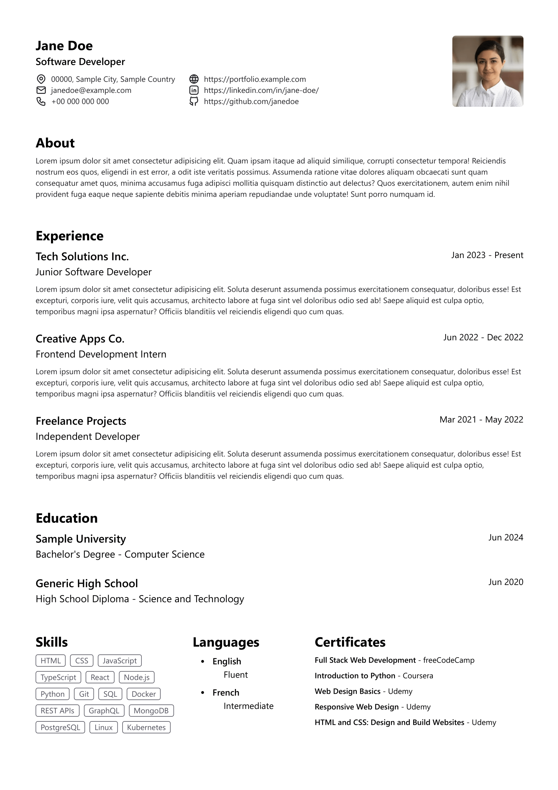

<h1 align="center">CV Generator</h1>

A tool designed to generate resumes from your resume details in a JSON file

> [!WARNING]
> I have made the template according to my needs, it may not fit your case but the structure can be easily modified by changing the styles on the `src/components/sections` files

<h2>Preview</h2>

</img>

<h2>Prerequisites</h2>

Before you begin, ensure you have the following installed:

<ul>
	<li><a href="https://nodejs.org/">Node.js</a></li>
</ul>

<h2>Installation</h2>
<h4>Clone the Repository</h4>

`git clone`

<h4>Navigate to the Project Directory</h4>

`cd cv-generator`

<h4>Install Dependencies</h4>

`npm install`

<h2>Usage</h2>
<h4>Prepare Your JSON Data</h4>
<ul>
	<li>Copy the file <code><a href="./data/cv-example.json">./data/cv-example.json</a></code> to <code>./data/cv.json</code> and edit the content to match your needs.</li>
	<li>Save your profile picture to <code><a href="./public/avatar.webp">./public/avatar.webp</a></code> or edit the <code>./data/cv.json</code> <code>basics.image</code> property and write the URL to your profile picture.</li>
	<li>Execute the command <code>npm run dev</code> to start the development server and preview your resume.</li>
	<li>Once you have what you want you can print or save the PDF file of your resume pressing <kbd>CTRL</kbd> + <kbd>P</kbd>.</li>
</ul>

<h2>Acknowledgments</h2>

This project is based on the <a href="https://github.com/midudev/minimalist-portfolio-json">Minimalist Portfolio JSON</a> project from <a href="https://github.com/midudev">midudev</a>.

